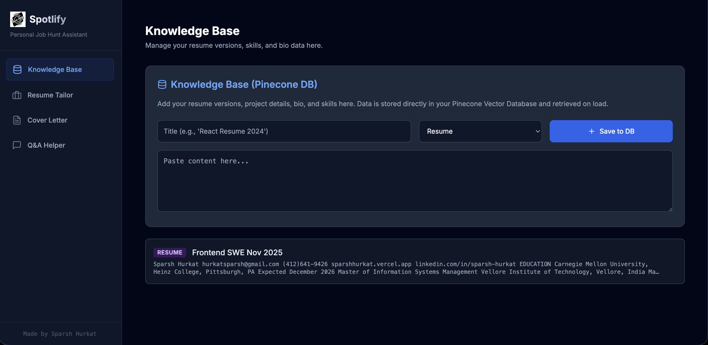
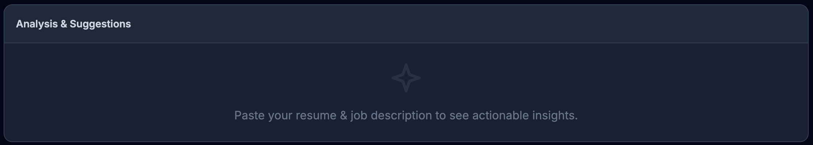
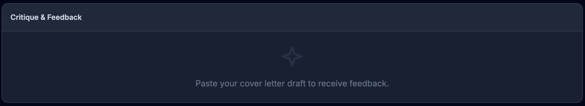

# 🎯 Spotlify - Your AI-Powered Career Assistant
> **About the name:** SPOT is the name of my website (https://sparshhurkat.vercel.app/), and this project is inspired by "simplify" — hence **Spotlify** (SPOT + simplify). No relation to Spotify, but I wish that wasn't taken XD

**Spotlify** is an intelligent career assistant that helps you craft the perfect resume, write compelling cover letters, and ace application questions using AI-powered RAG (Retrieval Augmented Generation) technology.

<div align="center">

</div>

## ✨ Features

<div align="center">

</div>

- 📝 **Resume Tailoring**: Get AI-powered analysis and suggestions to tailor your resume for specific job postings
<div align="center">

</div>
- 💌 **Cover Letter Generator**: Create personalized cover letters that highlight your relevant experience
<div align="center">

</div>
- 💬 **Question Assistant**: Get AI-generated answers to application questions using your experience database
- 🧠 **Smart Knowledge Base**: Store and retrieve your career history, projects, and skills using vector embeddings
- 🔍 **Semantic Search**: Find relevant experiences from your database using natural language queries

## 🛠️ Tech Stack

- **Frontend**: React 19 + TypeScript + Vite
- **AI**: Google Gemini 2.5 Flash
- **Vector Database**: Pinecone
- **Embeddings**: Google text-embedding-004

## 🚀 Quick Start

**Prerequisites:** Node.js 18+ installed

1. **Install dependencies:**
   ```bash
   npm install
   ```

2. **Set up environment variables:**
   
   Create a `.env.local` file in the root directory with:
   ```env
   GEMINI_API_KEY=your_gemini_api_key_here
   PINECONE_API_KEY=your_pinecone_api_key_here
   PINECONE_INDEX_URL=https://your-index-name-xxxxx.svc.environment.pinecone.io
   ```

3. **Run the app:**
   ```bash
   npm run dev
   ```

4. **Open your browser:**
   Navigate to `http://localhost:3000`

## 📖 How It Works

1. **Build Your Knowledge Base**: Add your resume versions, project details, skills, and experience to the knowledge base
2. **Vector Embedding**: Your content is automatically chunked, embedded, and stored in Pinecone
3. **Smart Retrieval**: When you need help, the system retrieves relevant context from your database
4. **AI-Powered Generation**: Gemini AI uses the retrieved context to generate personalized, accurate responses

## 🎯 Use Cases

- Tailor your resume for different job applications
- Generate cover letters that match job descriptions
- Answer behavioral interview questions using the STAR method
- Keep track of all your career experiences in one place

## 🔧 Development

```bash
# Development server
npm run dev

# Build for production
npm run build

# Preview production build
npm run preview
```

---
